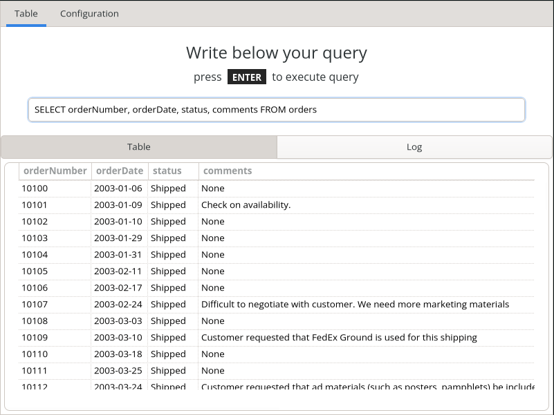
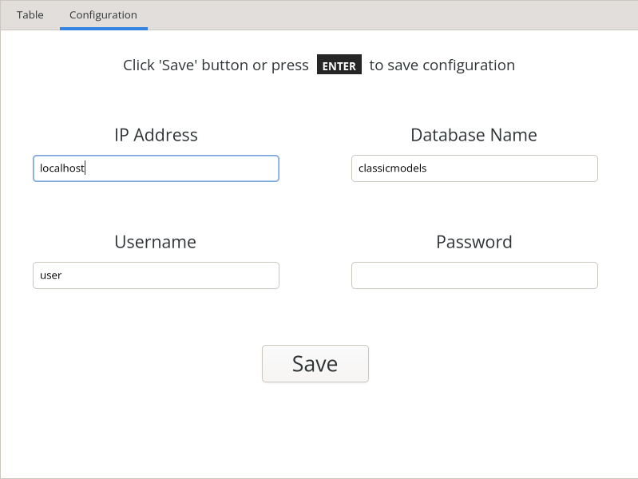

# Show Table




Simple GUI application for view database records.

## How to use

1. Download project.
2. Go to project folder.
3. Run in bash:
    ```bash
    python -m venv env
    ```
    ```bash
    source env/bin/activate
    ```
    ```bash
    pip install -r requirements.txt
    ```

##### And start app:
```python
python ShowTable
```

## Dependencies

* Python => 3.10
* PyGObject => 3.48.1
* pycario => 1.26.0
