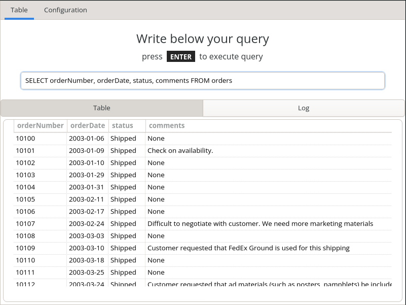

# Show Table




Simple GUI application for view database records.

## How to use

1. Download project.
2. Go to project folder.
3. Run with python:
    ```
    python3.10 Show\ Table.py
    ```

## Dependencies

* Python 3.10
* GTK4
* via pip:
    ``` 
    mysql-connector-python >= 8.0.32
    PyGObject >= 3.42.2
    ```
